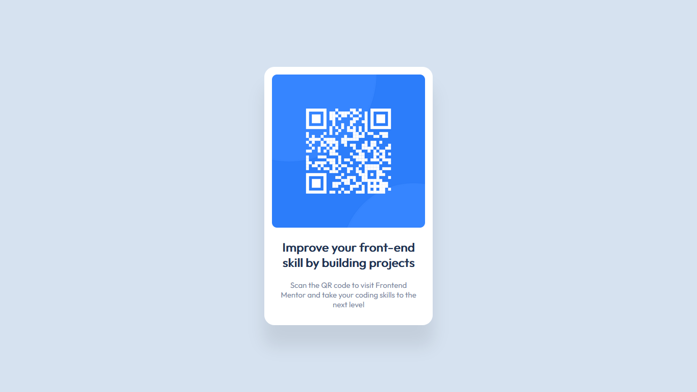

# Frontend Mentor - QR code component solution

This is a solution to the [QR code component challenge on Frontend Mentor](https://www.frontendmentor.io/challenges/qr-code-component-iux_sIO_H). Frontend Mentor challenges help you improve your coding skills by building realistic projects. 

## Table of contents

- [Overview](#overview)
  - [Screenshot](#screenshot)
  - [Links](#links)
- [My process](#my-process)
  - [Built with](#built-with)
  - [What I learned](#what-i-learned)
- [Author](#author)

## Overview

### Screenshot



### Links

- Solution URL: [My solution](https://www.frontendmentor.io/solutions/simple-site-with-scss-as-css-preprocessor-bq0kc3Odr)
- Live Site URL: [QR Code Component](https://qr-code-fem.netlify.app/)

## My process

### Built with

- SCSS (CSS preprocesser)
- CSS
- HTML5

### What I learned

So I finally learned how to center a `<div>` without CSS Flexbox...
```css
    position: absolute;
    top: 50%;
    left: 50%;
    transform: translate(-50%, -50%);
```

## Author

- Frontend Mentor - [@Kemystra](https://www.frontendmentor.io/profile/Kemystra)